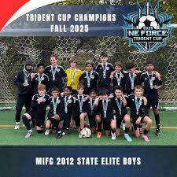
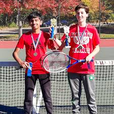
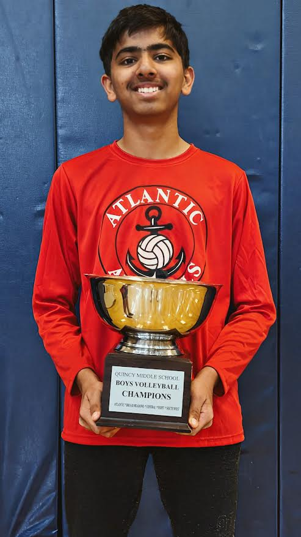

<!DOCTYPE html>
<html lang="en">
<head>
  <meta charset="UTF-8" />
  <meta name="viewport" content="width=device-width, initial-scale=1.0" />
  <title>Shourya Deshmukh | Accomplishments</title>
  
</head>
<body>
  <header>
    <h1>Shourya Deshmukh</h1>
    

      A personal website highlighting my academic, athletic, and personal
      accomplishments throughout my life.
    

  </header>

  <section>
    <h2>Early Life</h2>
    

      

        <h3>Age 7</h3>
        

          Moved to <strong>Quincy, Massachusetts</strong>, where I began building
          the foundation for my academic and athletic journey.
        

      

    

  </section>

  <section>
    <h2>Academic Achievements</h2>
    

      

        <h3>Age 12 – MCAS</h3>
        

          Scored <strong>559 out of 560</strong> on the MCAS, demonstrating strong
          academic performance and consistency.
        

      

    

  </section>

  <section>
    <h2>Finance & Investing</h2>
    

      

        <h3>Age 12 – Investing Journey</h3>
        

          Convinced my dad to open a <strong>custodial brokerage account</strong>
          for me. I began learning how markets work, trading responsibly, and
          developing a long-term interest in finance and investing.
        

      

    

  </section>

  <section>
    <h2>Athletic Achievements</h2>
    

      

        <h3>Age 14 – Soccer</h3>
        

          Won the <strong>Trident Cup</strong> with <strong>Mass International</strong>,
          competing at a high level and contributing to a championship team.
        

      

      

        <h3>Age 14 – Tennis</h3>
        

          Helped my school win its <strong>first-ever citywide doubles tennis
          championship</strong>, marking a historic achievement for the program.
        

      

      

        <h3>Age 14 – Volleyball</h3>
        

          Member of the school volleyball team that won the
          <strong>city championship</strong>, showcasing teamwork and discipline.
        

      

    

  </section>

  <section>
    <h2>Photos</h2>
    

      
      
        
    

  </section>

  <footer>
    
© 2026 Shourya Deshmukh | Personal Accomplishments

  </footer>
</body>
</html>
